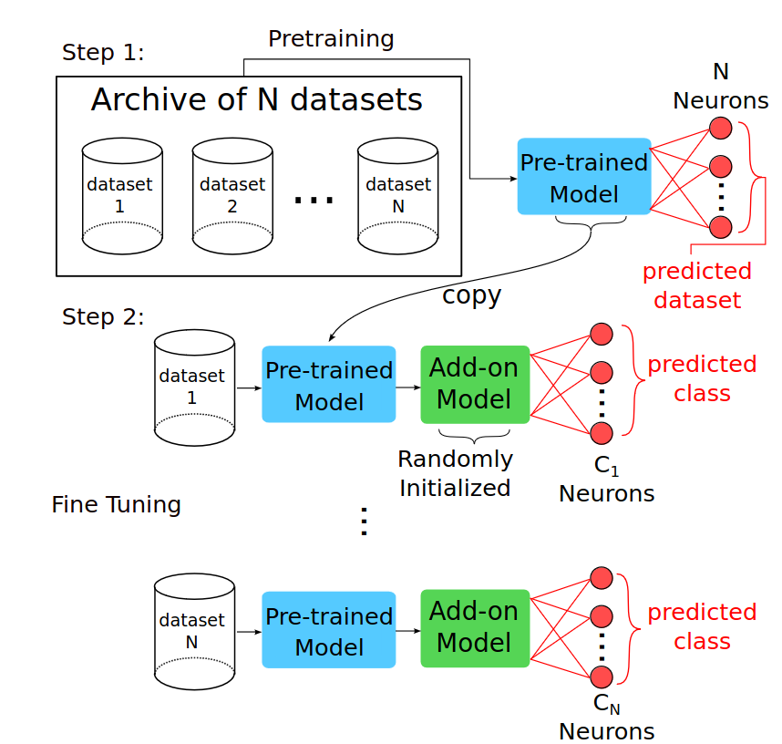
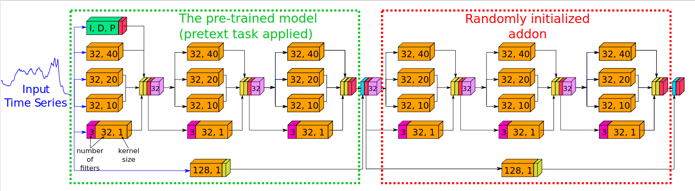
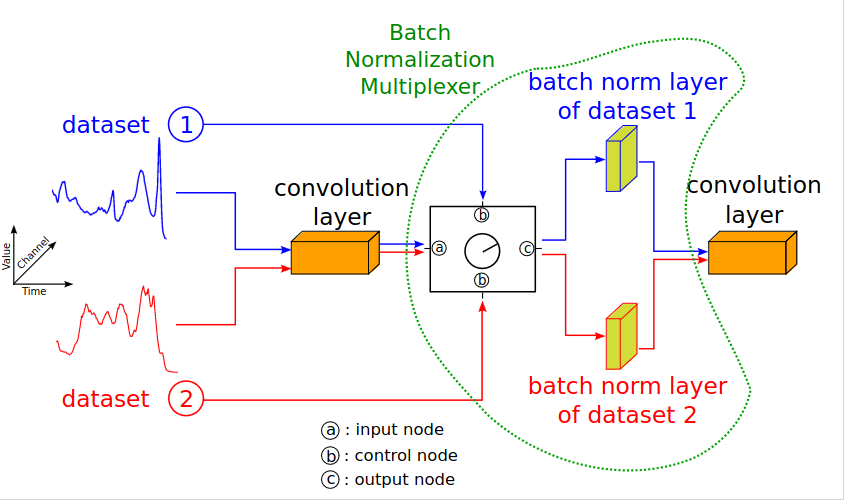
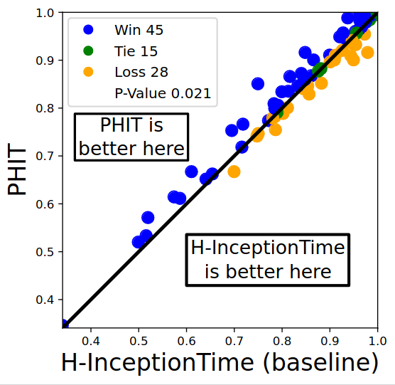
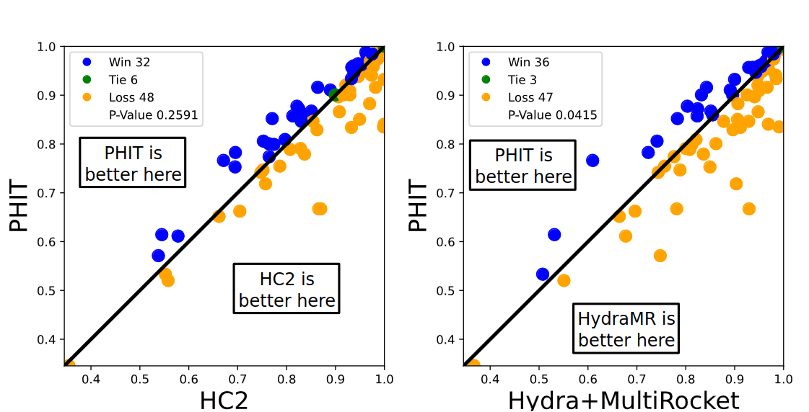
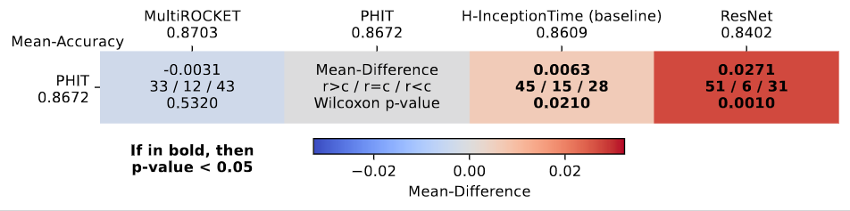
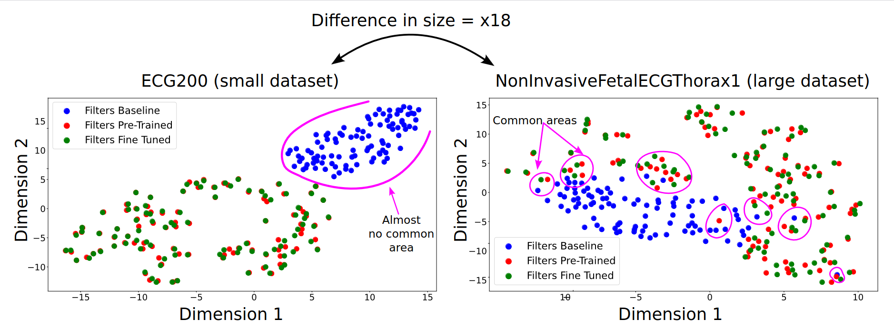

# Finding Foundation Models for Time Series Classification with a PreText Task

Authors: [Ali Ismail-Fawaz](https://hadifawaz1999.github.io/)1, [Maxime Devanne](https://maxime-devanne.com/)1, [Stefano Berretti](http://www.micc.unifi.it/berretti/)2, [Jonathan Weber](https://www.jonathan-weber.eu/)1 and [Germain Forestier](https://germain-forestier.info/)13

1 [MSD-IRIMAS, Université de Haute-Alsace, France](https://msd-irimas.github.io/)
2 [MICC, University of Florence, Italy](http://www.micc.unifi.it/)
3 [DSAI, Monash University, Australia](https://www.monash.edu/it/dsai)

This repository contains the source code for our Foundation model paper titled "Finding Foundation Models for Time Series Classification with a PreText Task". In this paper, we pre-train a deep learning model on a pretext task on multiple datasets from the same domain. This is followed by fine tuning this model on each dataset independently for their own classification task. Here is a summary figure of the approach.
A preprint of our paper is available on [arxiv](https://arxiv.org/abs/2311.14534)

## Architecture backbone

We utilize the H-Inception architecture from [Ismail-Fawaz et al 2022](https://ieeexplore.ieee.org/abstract/document/10020496)

We fix the distribution problem of the domain-shift in the batch normalization layers by proposing the Batch Nomrlization Multiplexer (BNM)

## Code Usage

This code is runnable using [docker](https://www.docker.com/) with tensorflow image for running on gpu.

### Creating the docker image
To create the docker image, run the following command in root  
`docker build -t IMAGE_NAME .`
All dependencies can be found in the `dockerfile`

### Creating the docker container
To create a docker container, first you need to have downloaded on your own pc the [UCR archive datasets](https://www.cs.ucr.edu/%7Eeamonn/time_series_data_2018/), they will be linked to the docker container after its creation.
Run the following command in root  
`docker run --gpus all -it --name CONTAINER_NAME -v "$(pwd):/pretext-code" -v "/path/to/ucr/on/your/pc:/ucr_archive" IMAGE_NAME bash` 

This will open a terminal inside the container, run the `main.py` file from this terminal to run the experiments, the main file will be inside the directory `/pretext-code` of the container as specified in the previous command `docker run...`

### Code configuration

The code's configuration uses `hydra`, all the information needed to setup the parameters are in the `config/config.yaml` file such as the list of datasets, number of epochs, batch size etc.

## Results

All results can be found in the [results_ucr.csv](https://github.com/MSD-IRIMAS/DomainFoundationModelsTSC/blob/main/results_ucr.csv) file containing the accuracy results over the used datastes of the baseline [H-InceptionTime](https://github.com/MSD-IRIMAS/CF-4-TSC/blob/main/classifiers/H_Inception.py), [ResNet](https://github.com/hfawaz/dl-4-tsc/blob/master/classifiers/resnet.py), [MultiROCKET](https://github.com/ChangWeiTan/MultiRocket) and PHIT.
Results with [HC2](https://github.com/aeon-toolkit/aeon/blob/main/aeon/classification/hybrid/_hivecote_v2.py) and [HydraMultiROCKET](https://github.com/angus924/hydra) can be found in [results_ucr_hc2_hydraMR.csv](https://github.com/MSD-IRIMAS/DomainFoundationModelsTSC/blob/main/results_ucr_hc2_hydraMR.csv)

### Results compared to the baseline

### Results compared to the state-of-the-art in Time Series Classification

Comparing to [HIVE-COTE2](https://link.springer.com/article/10.1007/s10994-021-06057-9) and [HydraMR](https://link.springer.com/article/10.1007/s10618-023-00939-3) from the recent Time Series Classification bake off [Middlehurst et al. 2023](https://arxiv.org/abs/2304.13029).

### Multi-Comparison Matrix

Using the code of the [Multi-Comparison Matrix](https://github.com/MSD-IRIMAS/Multi_Comparison_Matrix) proposed in [Ismail-Fawaz et al. 2023](https://arxiv.org/abs/2305.11921)

### Visualization of filters space

Comparing below using t-SNE the filters space on two datasets, [ECG200](http://timeseriesclassification.com/description.php?Dataset=ECG200) and [NonInvasiveFetalECGThorax1](http://timeseriesclassification.com/description.php?Dataset=NonInvasiveFetalECGThorax1), among the baseline model, the pretrained model and the fine tuned model

## Acknowledgments

This work was supported by the ANR DELEGATION project (grant ANR-21-CE23-0014) of the French Agence Nationale de la Recherche. The authors would like to acknowledge the High Performance Computing Center of the University of Strasbourg for supporting this work by providing scientific support and access to computing resources. Part of the computing resources were funded by the Equipex Equip@Meso project (Programme Investissements d’Avenir) and the CPER Alsacalcul/Big Data. The authors would also like to thank the creators and
providers of the UCR Archive.
